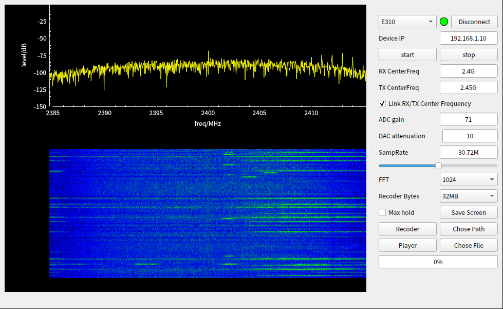
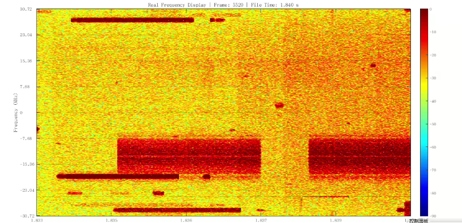

# Firmware Implementation of High-Speed ​​Baseband Signal Recording and Playback Functions

## Recording Function

Based on the ANTSDR E310 and ANTSDR E200 platforms, the system enables continuous recording of high-speed baseband IQ signals, achieving continuous, stable, and packet-free data acquisition at a sampling rate of 61.44 MSPS.

### Key Features include:

Supports continuous IQ data stream acquisition

Supports a maximum sampling rate of 61.44 MSPS

In the current system architecture, taking the ANTSDR E310 as an example, a maximum of 2 seconds of continuous recording without packet loss can be achieved.

Supports button-triggered recording function.

### Baseband Signal Playback (Replay) Function

The system supports accurate playback and transmission of recorded baseband IQ data from the ANTSDR E310 and ANTSDR E200 platforms, enabling the reproduction of real-world wireless scenarios.

Supports reading IQ data from local storage files.

Supports transmission at specified sampling rate, center frequency, and gain.

Through the playback function, the original wireless signal characteristics, including modulation scheme, spectral shape, and time-domain structure, can be reproduced in an 
experimental environment.

### Integrated Recording and Playback Software and API Support

The system provides complete software tools and programming interfaces, allowing users to flexibly utilize recording and playback capabilities:

Provides independent recording software tools

Provides independent playback software tools

Provides a unified recording/playback API interface

Supports secondary development and system integration

Users can quickly implement the following via API:

## Key Parameter Description

Device Platform: ANTSDR E310 and ANTSDR E200

Configurable Sampling Rate: Maximum supported 61.44 MSPS

Maximum Continuous Recording Duration: 2 seconds (based on ANTSDR E310) (No packet loss under 61.44 MSPS)

API Type: C/C++ Interface

Platform Support: Linux/Windows

Configurable Options: Center frequency, sampling rate, gain, file size, etc.

Data Analysis: Data can be imported into MATLAB for analysis.

